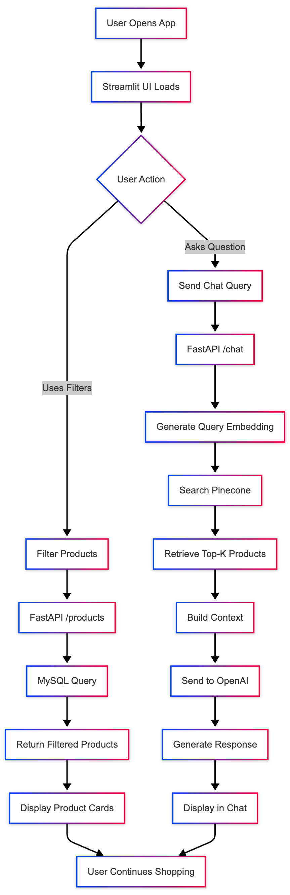
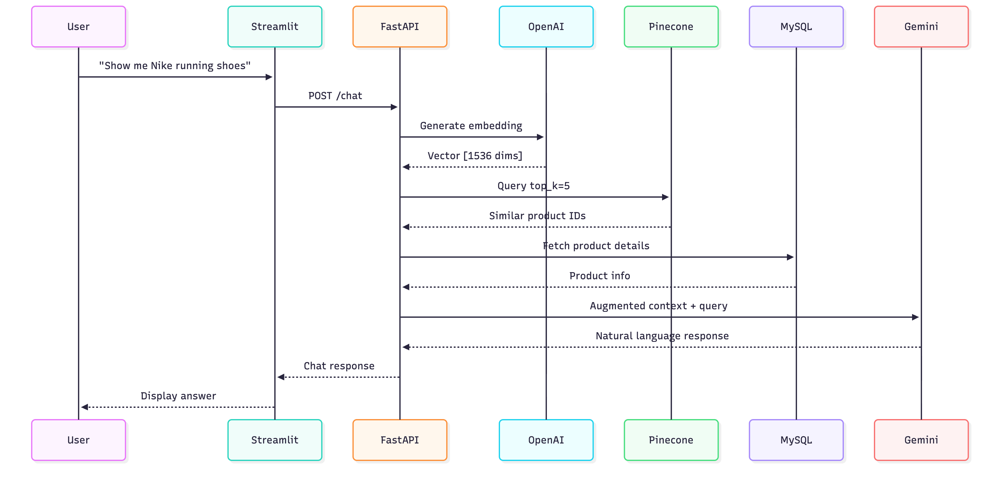
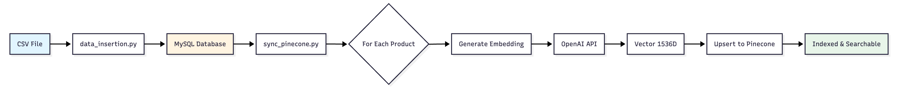
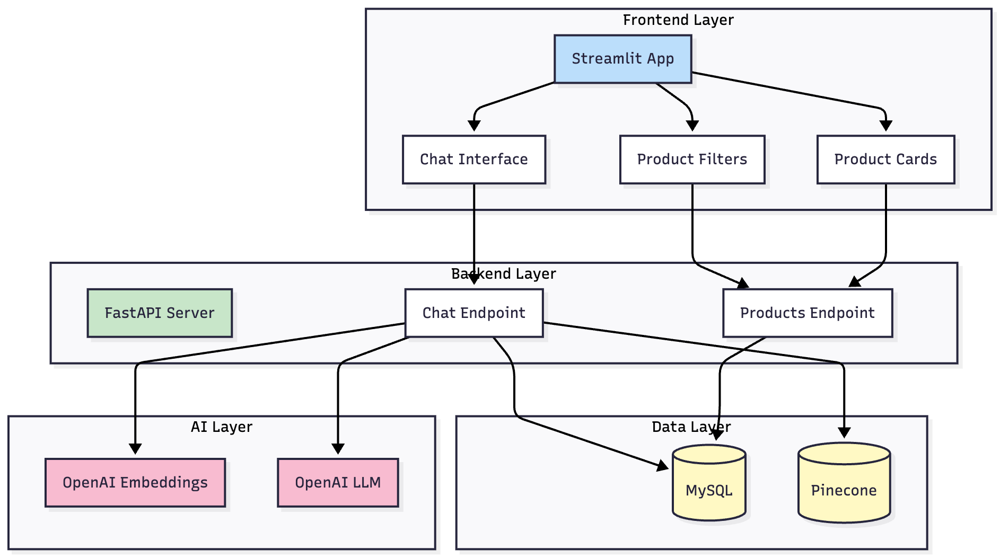
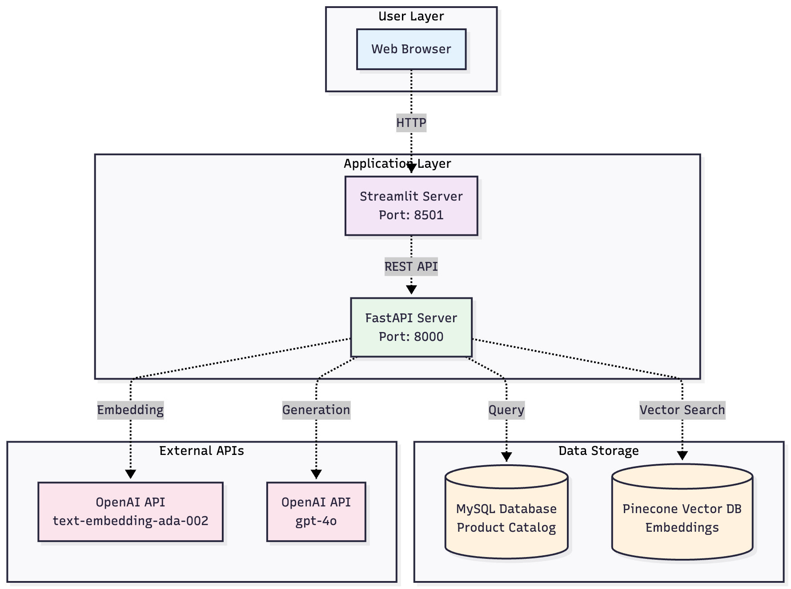
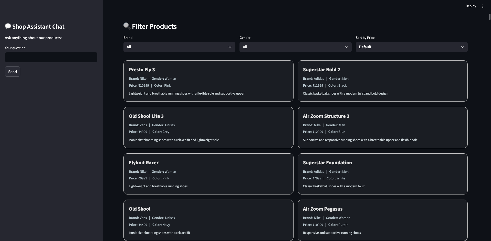
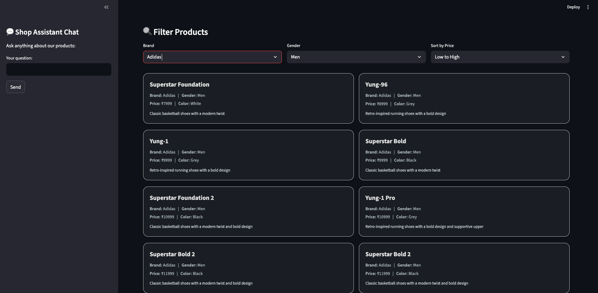
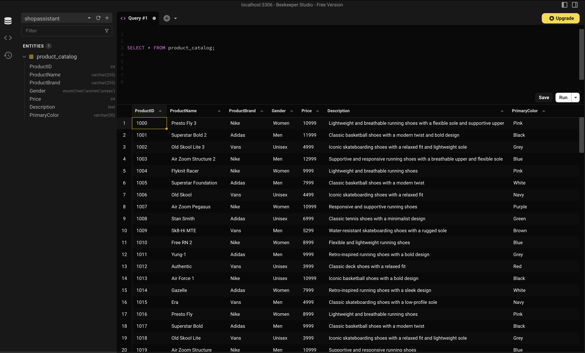

# 🛍️ Shop Assistant RAG Chatbot

[](https://www.python.org/downloads/)
[](https://fastapi.tiangolo.com/)
[](https://streamlit.io/)
[](LICENSE)

> An intelligent AI-powered shopping assistant that helps users explore product catalogs using natural language queries powered by Retrieval-Augmented Generation (RAG).

## 🎯 Overview

The **Shop Assistant RAG Chatbot** is a full-stack AI application that revolutionizes online shopping by combining traditional product filtering with conversational AI. Users can browse products using filters OR ask natural language questions to find exactly what they're looking for.

### Use Case

**Traditional Problem:**

- Users struggle to find products using rigid filters
- Product searches require exact keyword matches
- No conversational way to explore catalogs
- Poor discovery of products matching vague requirements

**Our Solution:**

- Natural language product queries ("Show me affordable Nike shoes for running")
- Semantic search understanding intent, not just keywords
- Real-time product filtering alongside AI chat
- Contextual recommendations based on product descriptions

## 💡 Problem Statement

E-commerce platforms often rely on traditional search and filter mechanisms that require users to know exactly what they're looking for. This creates friction in the shopping experience:

1. **Limited Search Flexibility**: Users must use exact product names or browse categories manually
2. **Poor Intent Understanding**: Traditional keyword search can't understand queries like "comfortable shoes for long walks"
3. **Information Overload**: Large product catalogs overwhelm users without intelligent guidance
4. **Lack of Personalization**: No conversational interface to understand user preferences

## ✨ Solution

Our RAG-powered chatbot bridges this gap by:

1. **Semantic Understanding**: Uses OpenAI embeddings to understand the meaning behind queries
2. **Intelligent Retrieval**: Leverages Pinecone vector database for fast, relevant product matching
3. **Natural Conversations**: Powered by OpenAI for human-like responses
4. **Dual Interface**: Combines traditional filtering with AI-powered chat
5. **Real-time Updates**: MySQL database ensures up-to-date product information

## 🚀 Key Features

### 💬 Intelligent Chatbot

- ✅ Natural language product queries
- ✅ Semantic search powered by OpenAI embeddings
- ✅ Context-aware responses using RAG architecture
- ✅ Multi-turn conversation support

### 🔍 Advanced Filtering

- ✅ Real-time filtering by brand, gender, and price
- ✅ Dynamic product cards with detailed information
- ✅ Sort by price (Low to High, High to Low)
- ✅ Responsive UI built with Streamlit

### 🏗️ Robust Backend

- ✅ FastAPI REST API with high performance
- ✅ MySQL database for structured product data
- ✅ Pinecone vector store for semantic search
- ✅ Modular architecture for easy scaling

### ⚡ Performance

- ✅ Fast vector similarity search (< 100ms)
- ✅ Efficient data synchronization between MySQL and Pinecone
- ✅ Optimized embeddings storage and retrieval

## 🛠 Tech Stack

| Component | Technology | Purpose |
|-----------|-----------|---------|
| **Frontend** | Streamlit | Interactive web interface |
| **Backend** | FastAPI | RESTful API server |
| **Database** | MySQL | Structured product data storage |
| **Vector DB** | Pinecone | Semantic search & embeddings |
| **LLM** | OpenAI GPT-4o | Natural language generation |
| **Embeddings** | OpenAI text-embedding-3-small | Text-to-vector conversion |
| **Package Manager** | UV | Fast Python dependency management |

## 🔧 Setup & Installation

### Prerequisites

- Python 3.11+
- MySQL Server 8.0+
- UV Package Manager ([Installation Guide](https://github.com/astral-sh/uv))
- OpenAI API Key
- Pinecone API Key

### Step 1: Clone the Repository

```bash
git clone https://github.com/sarjak369/shop-assistant-rag-chatbot.git
cd shop-assistant-rag-chatbot
```

### Step 2: Install UV (if not installed)

```bash
# macOS/Linux
curl -LsSf https://astral.sh/uv/install.sh | sh

# Windows
powershell -c "irm https://astral.sh/uv/install.ps1 | iex"
```

### Step 3: Initialize Project

```bash
# Create virtual environment and install dependencies
uv venv
source .venv/bin/activate  # On Windows: .venv\Scripts\activate

# Install project dependencies
uv pip install -r requirements.txt
```

### Step 4: Set Up MySQL Database

```sql
CREATE DATABASE shopassistant;
USE shopassistant;

-- Table will be created automatically by data_insertion.py
```

### Step 5: Configure Environment Variables

Create `.env` file in the root directory:

```env
# MySQL Configuration
MYSQL_HOST=localhost
MYSQL_USER=root
MYSQL_PASSWORD=your_password
MYSQL_DATABASE=shopassistant

# API Keys
OPENAI_API_KEY=your_openai_api_key
PINECONE_API_KEY=your_pinecone_api_key

# Pinecone Configuration
PINECONE_ENVIRONMENT=your_environment
PINECONE_INDEX_NAME=shop-products
```

### Step 6: Load Data & Sync Pinecone

```bash
# Insert product data into MySQL
uv run data/data_insertion.py

# Sync data to Pinecone vector database
uv run embedding/sync_pinecone.py
```

## 🚀 Usage

### Run the Application

**Terminal 1 - Start Backend:**

```bash
cd backend
uvicorn main:app --reload --port 8000
```

**Terminal 2 - Start Frontend:**

```bash
cd frontend
streamlit run app.py
```

Access the application at: `http://localhost:8501`

### Using UV for Running

```bash
# Backend
uv run uvicorn backend.main:app --reload

# Frontend
uv run streamlit run frontend/app.py
```

## 📡 API Documentation

### Base URL

```bash
http://127.0.0.1:8000
```

### Endpoints

#### 1. Get All Products

```http
GET /products
```

**Query Parameters:**

- `brand` (optional): Filter by brand (e.g., Nike, Adidas, Puma)
- `gender` (optional): Filter by gender (Men, Women, Unisex)
- `min_price` (optional): Minimum price
- `max_price` (optional): Maximum price

**Response:**

```json
[
  {
    "ProductID": 1000,
    "ProductName": "Presto Fly 3",
    "ProductBrand": "Nike",
    "Gender": "Women",
    "Price": 10999,
    "Description": "Lightweight and breathable running shoes...",
    "PrimaryColor": "Pink"
  }
]
```

#### 2. Chat with Assistant

```http
POST /chat
```

**Request Body:**

```json
{
  "query": "Show me Puma shoes under 5000",
  "history": []
}
```

**Response:**

```json
{
  "response": "I found some great Puma options under ₹5000...",
  "history": [
    {
      "User": "Show me Puma shoes under 5000",
      "Assistant": "I found some great Puma options..."
    }
  ]
}
```

## 📊 Mermaid Diagrams

### 1. Application Flow Diagram



### 2. RAG Pipeline Architecture



### 3. Data Synchronization Flow



### 4. Component Interaction



### 5. System Deployment Architecture



## 📸 Screenshots

### Main Interface - Product Catalog with Chat



*Users can browse products using filters while simultaneously asking questions via the sidebar chatbot.*

### Chat Interface - Natural Language Queries


*The AI assistant understands natural language and provides contextual product recommendations.*

### Filtered Results - Brand & Gender



*Real-time filtering shows products matching specific criteria like brand and gender.*

### Database



*Product catalog stored in MySQL with structured schema.*

## 🧪 Example Queries

Try these natural language queries with the chatbot:

### Basic Product Search

```bash
- "What is the price of Superstar Pro 5?"
- "Any stylish sneakers in black?"
- "Show Nike shoes for Women"
```

### Price-Based Queries

```bash
- "Show me Puma shoes under 5000"
- "What are affordable items for men?"
- "Find products between 3000 and 8000 rupees"
```

### Feature-Based Search

```bash
- "Show me lightweight running shoes"
- "Do you have basketball shoes?"
```

### Brand & Gender Filters

```bash
- "Show me all Adidas products for men"
- "What Vans shoes do you have for women?"
- "Nike unisex products under 10000"
```

## 🎯 Why RAG Architecture?

### Traditional Chatbot Limitations

- ❌ Limited to training data
- ❌ Can't access real-time product info
- ❌ Hallucinations about product details
- ❌ No way to search large catalogs

### RAG Benefits

- ✅ Always up-to-date product information
- ✅ Semantic search understands intent
- ✅ Factual responses grounded in data
- ✅ Scalable to millions of products
- ✅ Combines retrieval + generation

## 🤝 Contributing

Contributions are welcome! Please feel free to submit a Pull Request.

1. Fork the repository
2. Create your feature branch (`git checkout -b feature/AmazingFeature`)
3. Commit your changes (`git commit -m 'Add some AmazingFeature'`)
4. Push to the branch (`git push origin feature/AmazingFeature`)
5. Open a Pull Request

## 📝 License

This project is licensed under the MIT License - see the [LICENSE](LICENSE) file for details.

## 🙏 Acknowledgments

- Dataset: [Kaggle - Shop Product Catalog](https://www.kaggle.com/datasets/supratimnag06/shop-product-catalog)
- OpenAI for embeddings and LLM API
- Pinecone for vector database
- Astral for UV package manager

---

⭐ **Star this repository if you find it helpful!**

📧 **Questions?** Open an issue or reach out via [email](mailto:your.email@example.com)
